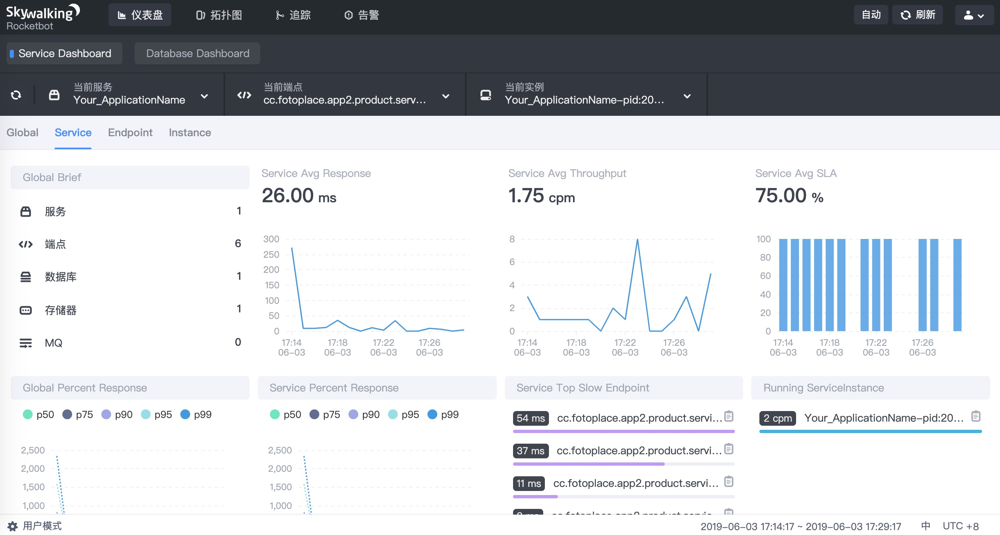
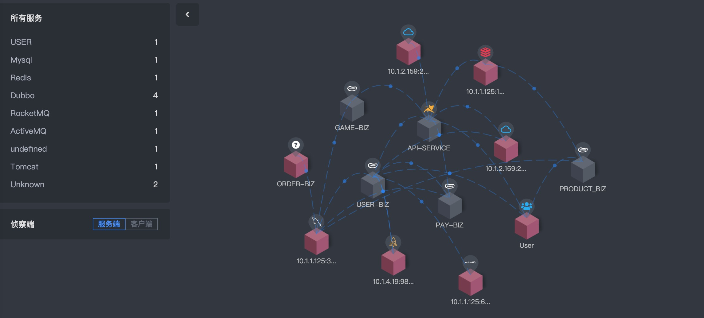
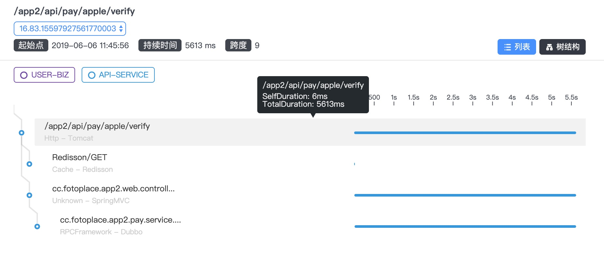
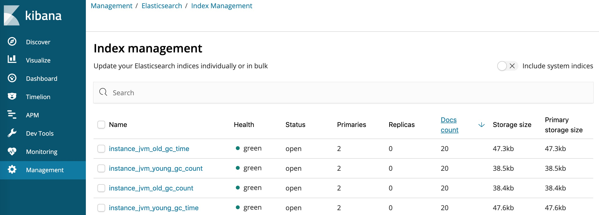

## 实战全链路跟踪 Skywalking/Zipkin

理解链路中的概念

1. logging - event时间落地
2. tracing - request范围
3. metrics - aggr聚合分析

参考: https://wu-sheng.github.io/me/articles/metrics-tracing-and-logging

zipkin使用: https://github.com/xuminwlt/j360-zipkin-parent
zipkin学习框架: https://github.com/xuminwlt/j360-trace

**Skywalking**

### Skywalking常用架构方案：

- zipkin+skywalking

**a) skywalkagent**
1. jvm
2. mesh

**b) zipkin**
1. trace

- skywalking agent + skywalking

**Skywalking Server部署**

https://github.com/apache/skywalking/blob/master/docs/en/setup/backend/backend-ui-setup.md

1. Server是一个前后端分离的架构, 生产部署时使用独立部署方案: 独立UI + 多集群化Backend模式
2. Backend部署时可能采用单机单VM或者单机多VM方案, 此时需要配置ip+port, application.yml提供3级的配置
3. 集群模式下初始化: 必须只能启动一台机器完成初始化过程, 集群的注册中心使用注册中心组建zk等需要完成对应的配置
4. 完成接收器的配置
5. 完成接收数据存储的配置
5. 完成链路采样率配置
6. 完成数据库慢查询定义的参数配置
7. 完成报警的功能配置

提供: grafana UI支持

**Skywalking Agent部署**

1. 查看Supported list确认支持的中间件和框架,确认收集信息颗粒度
2. 可选配置外部config方案和外部环境配置变量配置,否则使用默认的config配置
3. 将agent默认拷贝至统一的目录, 使用shell方案通过agent命令完成配置

https://github.com/apache/skywalking/blob/master/docs/en/setup/service-agent/java-agent/README.md


Q&A
1. 如何手动完成部分SPAN API追踪
https://github.com/apache/skywalking/blob/master/docs/en/setup/service-agent/java-agent/Application-toolkit-trace.md

2. 如何支持跨线程问题
https://github.com/apache/skywalking/blob/master/docs/en/setup/service-agent/java-agent/Application-toolkit-trace-cross-thread.md

3. 如何自定义行为的范围
https://github.com/apache/skywalking/blob/master/docs/en/setup/service-agent/java-agent/Customize-enhance-trace.md

https://github.com/apache/skywalking/blob/master/docs/en/setup/README.md

4. zipkin -> skywalking
https://github.com/apache/skywalking/issues/2653

## 实战案例

**准备阶段**

1. elasticsearch 
- v6.3.2   v6.8+ v7.0+不支持
- host: 10.1.4.19:9200

2. kibana 
- v6.3.2
- 10.1.2.159:5601

3. skywalking 6.1 backend(UI+OAP)

定义storage为elasticsearch

```
storage:
  elasticsearch:
    nameSpace: ${SW_NAMESPACE:""}
    clusterNodes: ${SW_STORAGE_ES_CLUSTER_NODES:localhost:9200}
#    user: ${SW_ES_USER:""}
#    password: ${SW_ES_PASSWORD:""}
    indexShardsNumber: ${SW_STORAGE_ES_INDEX_SHARDS_NUMBER:2}
    indexReplicasNumber: ${SW_STORAGE_ES_INDEX_REPLICAS_NUMBER:0}
#    # Batch process setting, refer to https://www.elastic.co/guide/en/elasticsearch/client/java-api/5.5/java-docs-bulk-processor.html
    bulkActions: ${SW_STORAGE_ES_BULK_ACTIONS:2000} # Execute the bulk every 2000 requests
    bulkSize: ${SW_STORAGE_ES_BULK_SIZE:20} # flush the bulk every 20mb
    flushInterval: ${SW_STORAGE_ES_FLUSH_INTERVAL:10} # flush the bulk every 10 seconds whatever the number of requests
    concurrentRequests: ${SW_STORAGE_ES_CONCURRENT_REQUESTS:2} # the number of concurrent requests
    metadataQueryMaxSize: ${SW_STORAGE_ES_QUERY_MAX_SIZE:5000}
    segmentQueryMaxSize: ${SW_STORAGE_ES_QUERY_SEGMENT_SIZE:200}
```

4. applications(spring boot) + agent shell

- 定义5个微服务模块

```
-rw-r--r-- 1 root root 2047 6月   3 17:12 agent.config
-rw-r--r-- 1 root root 2035 6月   6 11:25 agent_game.config
-rw-r--r-- 1 root root 2035 6月   6 11:25 agent_order.config
-rw-r--r-- 1 root root 2035 6月   6 11:25 agent_pay.config
-rw-r--r-- 1 root root 2037 6月   4 11:44 agent_product.config
-rw-r--r-- 1 root root 2035 6月   3 18:23 agent_user.config
```

- 定义shell启动入口 -agent

```
-javaagent:/data/agent/skywalking-agent.jar
-Dskywalking_config=/data/agent/config/{agent_module}.config  #根据微服务名称定义
```

**监控阶段**

1. Skywalking Server工作台


2. 工作台中展示的微服务拓扑图


3. 链路树的展示


4. 生产以ES作为存储时的数据管理
