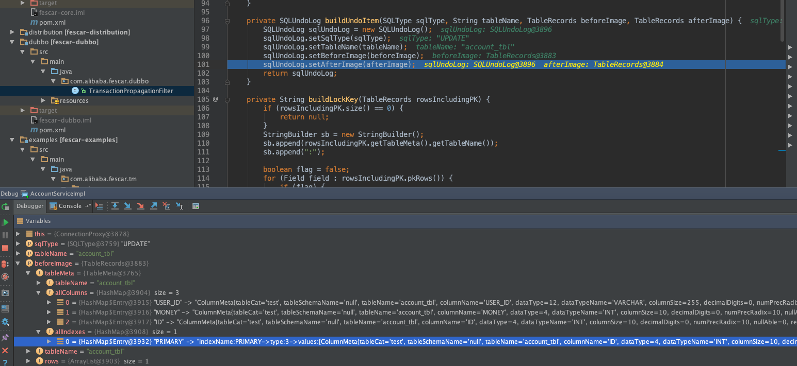
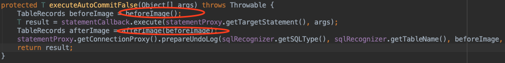
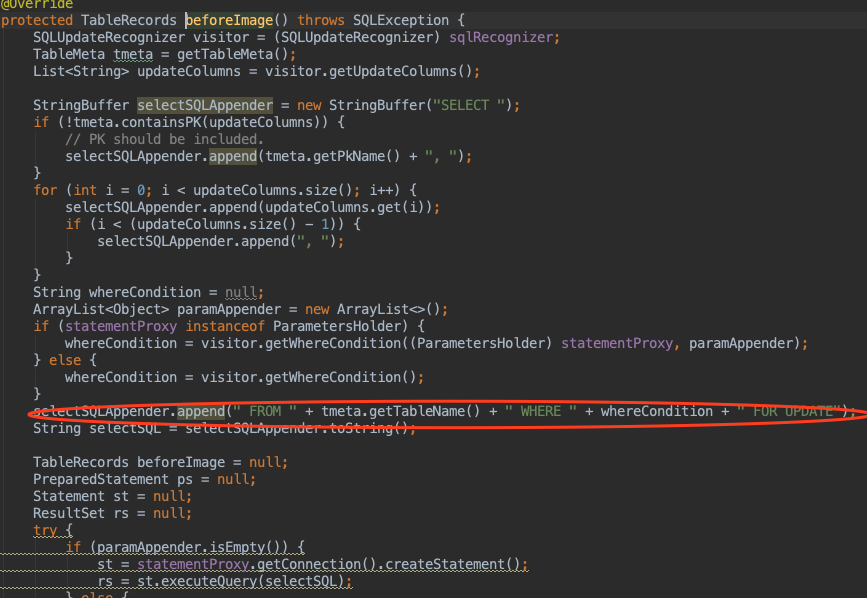
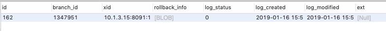

## Undo核心逻辑与实现

UndoLog的组成结构:表Metadata+BeforeImage+AfterImage+LockKey

Undo在执行中的实现顺序

BeforeImage镜像数据获取方式

镜像在undo_log保存的方式

## 关于ReadUnCommit

|事务隔离级别	| 脏读 |	不可重复读	| 幻读 |
|---|:---:|:---:|:---:|
|读未提交（read-uncommitted）|是	|是 |是|
|不可重复读（read-committed）	|否	|是	|是|
|可重复读（repeatable-read）	|否	|否	|是|
|串行化（serializable）	   |否	|否	|否|

## 全局读未提交事故

充值与佣金,原始0
场景: 购买物品需要先充值个人账户,再生成订单发生扣款

- XID=1 A 充值100块 A+100=100,1%手续费 佣金账户Z+1 本地事务成功
- XID=2 B 佣金账户提现 1元Z-1=0 事务成功
- XID=1 A 购买100块 A-100=0 本地事务成功
- XID=1 A 生成购买订单 失败,回滚,全局事务回滚

## 读已提交(不可重复读,同一事务内读取到不同的数据)

使用Select For Update读已提交级别时

- XID=1 A 充值100块 A+100=100,1%手续费 佣金账户Z+1 本地事务成功
- XID=2 B 佣金账户提现 0元Z 无法提现
- XID=1 A 购买100块 A-100=0 本地事务成功
- XID=1 A 生成购买订单 失败,回滚,全局事务回滚

当资源被共享或者该资源更新依赖了可能存在他人更新的数据时,务必使用读已提交,并且需要注意性能问题。乐观锁方案在此处无效。

读已提交在Fescar中的实现,待确认

Fescar在这里使用资源Lock冲突实现,当读去一条数据时,如果全局事务存在该条数据的资源锁存在时,则说明该处资源被占用,需要读取被修改之前的数据。该数据保存在Undo逻辑中

## 使用前提

Fescar需要确保本地RM是具备ACID的数据库实例, 如果本地事务存在多库插入则需要二次拆分多条本地事务

## 核心解读
com.alibaba.fescar.rm.datasource.DataSourceProxy

DataSourceProxy作为某个单一本地事务数据库代理,最小的代理单元是Datasource, 分库情况下数据代理到所有的数据库,当发生多个库提交动作,分别会有多个RM存在

